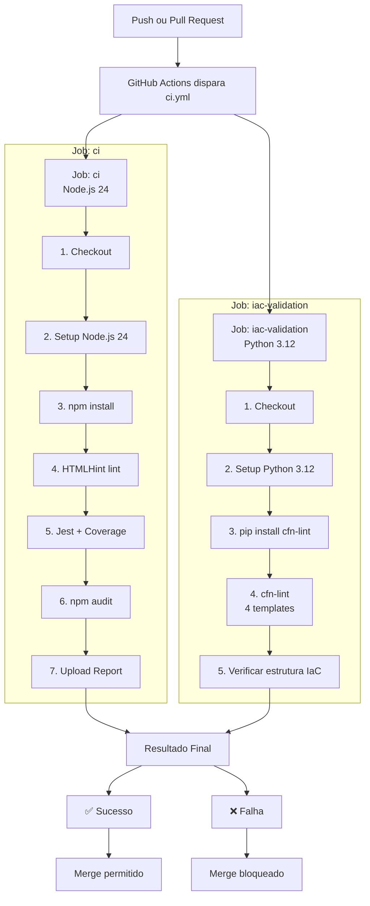

# Relatório — Fase 1: Configuração e Automação Inicial

**Aluna:** Daiane Deponti Bolzan  
**E-mail:** daiane.deponti@edu.pucrs.br  
**Instituição:** PUCRS — Pontifícia Universidade Católica do Rio Grande do Sul  
**Disciplina:** DevOps na Prática  
**Repositório:** https://github.com/Daaaiii/Devops  
**Data:** Junho de 2026

---

## Sumário

1. [Documentação de Planejamento](#1-documentação-de-planejamento)
2. [Pipeline de Integração Contínua](#2-pipeline-de-integração-contínua)
3. [Scripts de Infraestrutura como Código](#3-scripts-de-infraestrutura-como-código)

---

## 1. Documentação de Planejamento

### 1.1 Descrição do Projeto

Este projeto implementa um pipeline de DevOps para uma aplicação web em HTML/JavaScript, servindo como base didática para aplicação das práticas ensinadas na disciplina. O escopo da Fase 1 abrange três entregas: a configuração do repositório com pipeline de Integração Contínua no GitHub Actions e a criação de templates de Infraestrutura como Código usando AWS CloudFormation.

A aplicação em si é uma página HTML simples com testes unitários escritos em Jest, o que permite demonstrar o funcionamento completo do pipeline — do commit ao relatório de cobertura — sem depender de um sistema de backend complexo.

### 1.2 Objetivos

| ID | Objetivo | Status |
|----|----------|--------|
| OBJ-01 | Configurar repositório no GitHub com branches e proteções | Concluído |
| OBJ-02 | Implementar pipeline de CI com GitHub Actions (lint, testes, auditoria) | Concluído |
| OBJ-03 | Desenvolver templates CloudFormation para provisionamento de rede, armazenamento e computação na AWS | Concluído |
| OBJ-04 | Integrar a validação dos templates IaC ao próprio pipeline de CI | Concluído |
| OBJ-05 | Documentar todas as etapas e decisões técnicas | Concluído |

### 1.3 Tecnologias Utilizadas

| Categoria | Tecnologia | Finalidade |
|-----------|-----------|------------|
| Linguagem | Node.js / JavaScript | Desenvolvimento da aplicação e execução dos testes |
| Controle de Versão | Git + GitHub | Repositório e colaboração |
| CI | GitHub Actions | Automação do pipeline de integração contínua |
| Lint | HTMLHint | Validação da qualidade do código HTML |
| Testes | Jest + jest-environment-jsdom | Testes unitários com simulação de DOM |
| IaC | AWS CloudFormation | Provisionamento de infraestrutura na nuvem |
| Nuvem | Amazon Web Services | Hospedagem e serviços gerenciados |

### 1.4 Plano de Integração Contínua

O pipeline de CI foi projetado para ser executado automaticamente sempre que código novo for enviado ao repositório, garantindo que nenhuma alteração quebre o projeto antes de chegar à branch principal. O fluxo adotado é:

1. **Trigger automático** — qualquer push para `main` ou `develop`, e qualquer Pull Request para `main`, inicia o pipeline.
2. **Dois jobs paralelos** — o job `ci` valida a aplicação (lint, testes, auditoria) enquanto o job `iac-validation` valida os templates CloudFormation. Rodar em paralelo reduz o tempo total de feedback.
3. **Feedback imediato** — o resultado (sucesso ou falha) aparece diretamente na interface do GitHub, bloqueando merges em caso de falha.
4. **Artefatos preservados** — o relatório de cobertura de testes é publicado como artefato do workflow e fica disponível por 7 dias.

A estratégia de branches adotada segue o GitFlow simplificado: `main` é a branch estável e protegida (merge só via PR aprovado com CI passando), `develop` recebe as integrações do dia a dia, e branches `feature/*` isolam o desenvolvimento de novas funcionalidades.

### 1.5 Especificação da Infraestrutura

A infraestrutura foi inteiramente definida como código usando quatro templates AWS CloudFormation organizados em camadas independentes:

- **Rede (`network.yaml`)** — VPC, subrede pública, Internet Gateway e tabela de rotas. Isolamento de rede fundamental para qualquer ambiente AWS.
- **Armazenamento (`storage.yaml`)** — bucket S3 para hospedagem estática do site e bucket de artefatos de build, ambos com versionamento habilitado.
- **Computação (`compute.yaml`)** — instância EC2 `t2.micro` (free tier) com Security Group, IAM Role com permissões mínimas e User Data para bootstrap automático.
- **Orquestração (`main.yaml`)** — stack raiz que referencia os três acima como nested stacks, permitindo provisionar toda a infraestrutura com um único comando.

Todos os templates aceitam o parâmetro `Environment` (`production`, `staging`, `development`), garantindo que o mesmo código possa ser usado em ambientes separados sem duplicação.

---

## 2. Pipeline de Integração Contínua

### 2.1 Visão Geral do Arquivo `ci.yml`

O arquivo `.github/workflows/ci.yml` define o pipeline de CI completo. Ele está localizado na pasta `.github/workflows/` do repositório, que é o caminho padrão reconhecido pelo GitHub Actions para descobrir e executar workflows automaticamente.

O pipeline é composto por dois jobs que rodam em paralelo: `ci` (valida a aplicação) e `iac-validation` (valida os templates CloudFormation). Abaixo cada seção é detalhada.

### 2.2 Gatilhos (`on`)

```yaml
on:
  push:
    branches:
      - main
      - develop
  pull_request:
    branches:
      - main
  workflow_dispatch:
```

O bloco `on` define quando o pipeline é acionado. Foram configurados três gatilhos:

- **`push` para `main` e `develop`** — qualquer commit enviado para essas branches dispara o pipeline automaticamente. Isso garante que código integrado seja sempre validado.
- **`pull_request` para `main`** — quando um Pull Request é aberto ou atualizado visando a branch `main`, o pipeline roda sobre o código do PR. O GitHub bloqueia o merge enquanto o CI não passar.
- **`workflow_dispatch`** — permite acionar o pipeline manualmente pela interface do GitHub, útil para reexecutar testes sem precisar fazer um novo commit.

### 2.3 Job `ci` — Lint, Testes e Auditoria

Este job valida a qualidade e a segurança da aplicação. Roda em um runner Ubuntu fornecido pelo GitHub (`ubuntu-latest`).

#### Passo 1 — Checkout do repositório

```yaml
- name: Checkout do repositório
  uses: actions/checkout@v4
```

Clona o repositório dentro do ambiente de execução (runner). Sem este passo, os demais não teriam acesso ao código-fonte. A action `actions/checkout@v4` é a forma oficial e recomendada pelo GitHub para isso.

#### Passo 2 — Configurar Node.js 20

```yaml
- name: Configurar Node.js 24
  uses: actions/setup-node@v4
  with:
    node-version: '24'
    cache: 'npm'
```

Instala e configura o Node.js na versão 24 (LTS atual) no runner. O parâmetro `cache: 'npm'` ativa o cache automático da pasta `node_modules` entre execuções, reduzindo o tempo de instalação das dependências em runs subsequentes. O Node.js é necessário porque tanto o Jest (testes) quanto o HTMLHint (lint) rodam sobre ele.

#### Passo 3 — Instalar dependências

```yaml
- name: Instalar dependências
  run: npm install
```

Executa `npm install` para baixar e instalar todas as dependências listadas no `package.json`, incluindo Jest, jest-environment-jsdom e HTMLHint. O arquivo `package-lock.json` garante que as versões instaladas sejam sempre as mesmas, tornando o build reproduzível.

#### Passo 4 — Lint: validar HTML

```yaml
- name: Lint — validar HTML
  run: npm run lint
```

Executa o HTMLHint sobre o arquivo `index.html`. O script `lint` é definido no `package.json` e aplica as regras configuradas no arquivo `.htmlhintrc`. Se alguma regra for violada (por exemplo, atributo `alt` ausente em imagens, tags não fechadas, etc.), o comando retorna código de saída diferente de zero e o pipeline falha, impedindo que código com problemas de qualidade avance.

#### Passo 5 — Testes unitários com cobertura

```yaml
- name: Testes unitários com cobertura
  run: npm test
```

Executa a suíte de testes unitários com Jest. O Jest roda os testes localizados em `__tests__/index.test.js` usando o ambiente `jsdom`, que simula um navegador (DOM) dentro do Node.js — necessário porque os testes validam comportamentos de HTML/JavaScript. O Jest também gera o relatório de cobertura de código na pasta `coverage/`, verificando se a cobertura mínima configurada (60%) foi atingida. Se algum teste falhar ou a cobertura ficar abaixo do mínimo, o pipeline interrompe com erro.

#### Passo 6 — Auditoria de segurança

```yaml
- name: Auditoria de segurança
  run: npm audit --audit-level=moderate
  continue-on-error: true
```

Executa `npm audit` para verificar se alguma das dependências instaladas possui vulnerabilidades conhecidas catalogadas pelo banco de dados do npm. O nível `--audit-level=moderate` faz o comando retornar erro apenas para vulnerabilidades de severidade moderada ou superior. O `continue-on-error: true` foi definido de forma intencional: vulnerabilidades em dependências de desenvolvimento (como o próprio Jest) frequentemente não têm correção disponível e não afetam a aplicação em produção — por isso o pipeline registra o aviso mas não bloqueia o build.

#### Passo 7 — Publicar relatório de cobertura

```yaml
- name: Publicar relatório de cobertura
  if: always()
  uses: actions/upload-artifact@v4
  with:
    name: coverage-report
    path: coverage/
    retention-days: 7
```

Faz o upload da pasta `coverage/` (gerada pelo Jest no passo anterior) como artefato do workflow. O `if: always()` garante que o upload ocorra mesmo quando o job falhou, permitindo inspecionar o relatório de cobertura para entender o que não foi testado. O artefato fica disponível por 7 dias na aba "Actions" do repositório no GitHub.

### 2.4 Job `iac-validation` — Validação CloudFormation

Este job roda em paralelo ao `ci` e valida os templates de infraestrutura, impedindo que templates com erros de sintaxe ou configurações inválidas cheguem ao repositório.

#### Passo 1 — Checkout do repositório

Idêntico ao job anterior: clona o repositório para que os templates CloudFormation fiquem acessíveis no runner.

#### Passo 2 — Configurar Python 3.12

```yaml
- name: Configurar Python 3.12
  uses: actions/setup-python@v5
  with:
    python-version: '3.12'
```

Instala Python 3.12 no runner. O Python é necessário porque a ferramenta de validação `cfn-lint` é um pacote Python.

#### Passo 3 — Instalar cfn-lint

```yaml
- name: Instalar cfn-lint
  run: pip install cfn-lint
```

Instala o `cfn-lint` (CloudFormation Linter), uma ferramenta oficial da AWS para validar templates CloudFormation. Ela verifica tipos de recursos, propriedades obrigatórias, valores inválidos e boas práticas, indo além da validação básica de sintaxe YAML.

#### Passo 4 — Validar templates CloudFormation

```yaml
- name: Validar templates CloudFormation
  run: |
    for template in network.yaml storage.yaml compute.yaml main.yaml; do
      cfn-lint infrastructure/cloudformation/$template || {
        code=$?
        [ $code -eq 4 ] && echo "⚠ $template: warnings" || exit $code
      }
    done
```

Itera sobre os quatro templates e executa `cfn-lint` em cada um. O tratamento do código de saída é importante: o `cfn-lint` retorna código `4` quando encontra apenas _warnings_ (avisos não críticos) e códigos `2` ou `6` para erros reais. O script permite que warnings passem sem bloquear o pipeline, mas falha imediatamente se houver um erro real em qualquer template.

#### Passo 5 — Verificar estrutura dos templates

```yaml
- name: Verificar estrutura dos templates
  run: |
    for template in network.yaml storage.yaml compute.yaml main.yaml; do
      if [ -f "infrastructure/cloudformation/$template" ]; then
        echo "✓ $template encontrado"
      else
        echo "✗ $template NÃO encontrado" && exit 1
      fi
    done
```

Verifica se todos os quatro arquivos obrigatórios existem no repositório. Esse passo é uma salvaguarda simples: garante que nenhum template foi acidentalmente apagado ou renomeado de forma que quebre a estrutura esperada do projeto.

### 2.5 Diagrama do Fluxo de Execução



---

## 3. Scripts de Infraestrutura como Código

### 3.1 Visão Geral

A infraestrutura do projeto é definida inteiramente como código usando AWS CloudFormation, o serviço nativo de IaC da Amazon. Essa abordagem garante que o ambiente possa ser recriado de forma idêntica e reproduzível a qualquer momento, eliminando a necessidade de configurações manuais no console AWS.

Os templates estão organizados em quatro arquivos YAML dentro da pasta `infrastructure/cloudformation/`, cada um responsável por uma camada específica da infraestrutura:

```
infrastructure/
└── cloudformation/
    ├── main.yaml       # Orquestração — referencia os três templates abaixo
    ├── network.yaml    # Rede: VPC, subrede, Internet Gateway, rotas
    ├── storage.yaml    # Armazenamento: buckets S3 para site e artefatos
    └── compute.yaml    # Computação: EC2, Security Group, IAM Role
```

### 3.2 Template `network.yaml` — Infraestrutura de Rede

Este template cria toda a camada de rede necessária para isolar e conectar os recursos do projeto na AWS.

**Parâmetros configuráveis:**

| Parâmetro | Padrão | Descrição |
|-----------|--------|-----------|
| `Environment` | `production` | Define o ambiente (`production`, `staging`, `development`). Usado para nomear os recursos. |
| `VpcCIDR` | `10.0.0.0/16` | Bloco de endereços IP da VPC. Define o espaço de endereçamento privado de toda a rede. |
| `PublicSubnetCIDR` | `10.0.1.0/24` | Bloco de endereços da subrede pública, contido dentro do bloco da VPC. |

**Recursos criados:**

**`AWS::EC2::VPC`** — cria uma rede privada virtual (Virtual Private Cloud) isolada na AWS. Todos os outros recursos de rede e computação do projeto residem dentro desta VPC. O bloco CIDR `10.0.0.0/16` fornece até 65.536 endereços IP privados. `EnableDnsHostnames` e `EnableDnsSupport` habilitam resolução de nomes DNS dentro da VPC, necessário para que instâncias se comuniquem por hostname.

**`AWS::EC2::InternetGateway`** — cria o gateway de internet, que é o componente que conecta a VPC à internet pública. Sem ele, nenhum tráfego consegue entrar ou sair da VPC.

**`AWS::EC2::VPCGatewayAttachment`** — anexa o Internet Gateway à VPC. O CloudFormation cria os dois recursos separadamente e esta associação os une. O `DependsOn` implícito garante a ordem correta de criação.

**`AWS::EC2::Subnet`** — cria uma subrede pública dentro da VPC usando o bloco `10.0.1.0/24` (256 endereços). `MapPublicIpOnLaunch: true` faz com que instâncias EC2 lançadas nesta subrede recebam automaticamente um IP público, dispensando configuração manual.

**`AWS::EC2::RouteTable`** e **`AWS::EC2::Route`** — criam a tabela de rotas da subrede pública e adicionam uma rota padrão (`0.0.0.0/0`) apontando para o Internet Gateway. Isso instrui a AWS a enviar qualquer tráfego com destino externo à internet através do gateway.

**`AWS::EC2::SubnetRouteTableAssociation`** — associa a tabela de rotas à subrede pública, ativando as rotas para os recursos dentro dela.

**Outputs exportados:**

| Output | Valor exportado | Usado por |
|--------|----------------|-----------|
| `VPCId` | ID da VPC criada | `compute.yaml` e `main.yaml` |
| `PublicSubnetId` | ID da subrede pública | `compute.yaml` e `main.yaml` |
| `VPCCidr` | Bloco CIDR da VPC | `main.yaml` (para referência) |

### 3.3 Template `storage.yaml` — Armazenamento S3

Este template cria os dois buckets S3 necessários ao projeto: um para hospedar o site estático e outro para armazenar artefatos gerados pelo pipeline de CI/CD.

**Parâmetros configuráveis:**

| Parâmetro | Padrão | Descrição |
|-----------|--------|-----------|
| `Environment` | `production` | Ambiente de deploy — compõe o nome dos buckets. |
| `BucketNameSuffix` | — | Sufixo obrigatório para tornar os nomes dos buckets únicos globalmente (ex: `devops-pucrs`). Nomes de bucket S3 são globais na AWS. |

**Recursos criados:**

**`AWS::S3::Bucket` (WebsiteBucket)** — bucket S3 configurado para hospedagem de site estático. O nome é construído dinamicamente via `!Sub 'devops-fase1-${Environment}-${BucketNameSuffix}'`. As configurações relevantes são:
- `WebsiteConfiguration` com `IndexDocument: index.html` e `ErrorDocument: error.html` — ativa o modo de site estático, que serve arquivos diretamente via HTTP sem necessidade de um servidor web.
- `PublicAccessBlockConfiguration` com todas as opções `false` — libera o acesso público ao bucket, necessário para que visitantes externos acessem o site.
- `VersioningConfiguration: Enabled` — mantém versões anteriores dos arquivos, permitindo rollback em caso de deploy incorreto.

**`AWS::S3::BucketPolicy` (WebsiteBucketPolicy)** — define a política de acesso do bucket de hospedagem. A política criada permite que qualquer pessoa (`Principal: '*'`) execute a ação `s3:GetObject` (leitura de objetos), ou seja, acesse publicamente os arquivos do site. Sem esta política, mesmo com o acesso público habilitado no bucket, as requisições HTTP seriam bloqueadas.

**`AWS::S3::Bucket` (ArtifactsBucket)** — bucket para armazenar artefatos gerados pelo pipeline (relatórios de cobertura, logs de build). Diferente do bucket do site, este não tem hospedagem estática nem acesso público. A regra de lifecycle `DeleteOldArtifacts` apaga automaticamente objetos com mais de 30 dias, controlando custos de armazenamento.

**Outputs exportados:**

| Output | Valor exportado | Usado por |
|--------|----------------|-----------|
| `WebsiteURL` | URL pública do site estático | `main.yaml` |
| `WebsiteBucketName` | Nome do bucket do site | `compute.yaml`, `cd.yml` |
| `WebsiteBucketArn` | ARN do bucket do site | Políticas IAM |
| `ArtifactsBucketName` | Nome do bucket de artefatos | `main.yaml` |

### 3.4 Template `compute.yaml` — Infraestrutura de Computação

Este template cria a instância EC2 que serve a aplicação web, junto com os recursos de segurança e identidade necessários para seu funcionamento seguro.

**Parâmetros configuráveis:**

| Parâmetro | Padrão | Descrição |
|-----------|--------|-----------|
| `Environment` | `production` | Ambiente de deploy. |
| `VpcId` | — | ID da VPC criada pelo `network.yaml`. Recebido como output daquele stack. |
| `SubnetId` | — | ID da subrede pública criada pelo `network.yaml`. |
| `InstanceType` | `t2.micro` | Tipo da instância EC2. `t2.micro` está no free tier da AWS. |
| `KeyPairName` | — | Nome do Key Pair para acesso SSH. Deve ser criado previamente no console AWS. |
| `WebsiteBucketName` | — | Nome do bucket S3 do site, recebido do output de `storage.yaml`. |
| `LatestAmiId` | via SSM | ID da AMI do Amazon Linux 2. Obtido automaticamente do Parameter Store da AWS, garantindo sempre a versão mais recente. |

**Recursos criados:**

**`AWS::EC2::SecurityGroup` (WebServerSecurityGroup)** — define as regras de firewall da instância. Permite entrada nas portas 80 (HTTP), 443 (HTTPS) e 22 (SSH) de qualquer IP (`0.0.0.0/0`), e libera todo tráfego de saída. Em um ambiente de produção real, a regra SSH seria restrita ao IP do administrador.

**`AWS::IAM::Role` (WebServerRole)** — define a identidade IAM que a instância EC2 assume. A política inline `S3WebsiteAccess` concede à instância apenas as permissões `s3:GetObject` e `s3:ListBucket` no bucket do site — aplicando o princípio do menor privilégio. A `ManagedPolicyArns` inclui `CloudWatchAgentServerPolicy`, permitindo que a instância envie métricas e logs para o CloudWatch sem necessidade de credenciais adicionais.

**`AWS::IAM::InstanceProfile` (WebServerInstanceProfile)** — associa a IAM Role à instância EC2. Instâncias EC2 não usam roles diretamente; elas usam Instance Profiles, que são o wrapper que entrega as credenciais temporárias da role para a instância.

**`AWS::EC2::Instance` (WebServerInstance)** — a instância EC2 em si. Destaque para o `UserData`, que é um script de bootstrap executado automaticamente na primeira inicialização da instância:

```bash
#!/bin/bash
yum update -y                                        # Atualiza o sistema operacional
yum install -y httpd aws-cli                         # Instala Apache e AWS CLI
systemctl start httpd                                # Inicia o servidor web
systemctl enable httpd                               # Configura para iniciar com o sistema
aws s3 cp s3://${WebsiteBucketName}/index.html \     # Copia o site do S3
  /var/www/html/index.html
```

Esse script elimina a necessidade de acessar a instância via SSH para instalar software ou copiar arquivos — a instância se auto-configura ao ser criada.

**Outputs exportados:**

| Output | Valor exportado |
|--------|----------------|
| `InstanceId` | ID da instância EC2 |
| `PublicIP` | Endereço IP público |
| `PublicDNS` | DNS público da instância |
| `WebsiteURL` | URL completa da aplicação (`http://<DNS>`) |
| `SecurityGroupId` | ID do Security Group |

### 3.5 Template `main.yaml` — Orquestração via Nested Stacks

Este template é o ponto de entrada para provisionar toda a infraestrutura com um único comando. Ele usa o recurso de **nested stacks** do CloudFormation para referenciar e criar os três templates anteriores como stacks aninhados.

**Parâmetros configuráveis:**

Consolida todos os parâmetros dos três templates mais dois adicionais:

| Parâmetro | Descrição |
|-----------|-----------|
| `TemplatesBaseURL` | URL base no S3 onde os templates foram carregados (necessário para nested stacks). |
| `Environment` | Ambiente de deploy (propagado para todos os stacks filhos). |
| `BucketNameSuffix` | Sufixo dos buckets S3 (propagado para `storage.yaml`). |
| `VpcCIDR` | Bloco CIDR da VPC (propagado para `network.yaml`). |
| `PublicSubnetCIDR` | Bloco CIDR da subrede (propagado para `network.yaml`). |
| `InstanceType` | Tipo da instância EC2 (propagado para `compute.yaml`). |
| `KeyPairName` | Key Pair para SSH (propagado para `compute.yaml`). |

**Como os nested stacks funcionam:**

O `main.yaml` cria três recursos do tipo `AWS::CloudFormation::Stack`, cada um apontando para a URL de um template no S3. A ordem de criação é controlada pelas dependências de output:

1. **`NetworkStack`** é criado primeiro, sem dependências.
2. **`StorageStack`** é criado em paralelo com o `NetworkStack`, pois também não depende de nenhum outro.
3. **`ComputeStack`** aguarda os dois anteriores, pois usa outputs de ambos:
   - `!GetAtt NetworkStack.Outputs.VPCId` — ID da VPC criada pelo stack de rede
   - `!GetAtt NetworkStack.Outputs.PublicSubnetId` — ID da subrede
   - `!GetAtt StorageStack.Outputs.WebsiteBucketName` — nome do bucket do site

Essa dependência entre os stacks é declarada implicitamente pelas referências `!GetAtt`, e o CloudFormation resolve a ordem de criação automaticamente.

### 3.6 Integração entre IaC e o Pipeline

Os templates CloudFormation não são usados apenas manualmente — eles estão integrados ao pipeline de CI/CD:

- **No CI (`ci.yml`)** — o job `iac-validation` valida os quatro templates com `cfn-lint` a cada push, garantindo que qualquer alteração nos templates seja validada antes do merge.
- **No CD (`cd.yml`)** — o `storage.yaml` é executado automaticamente via `aws cloudformation deploy` antes do deploy do site. O nome do bucket criado é obtido pelo output `WebsiteBucketName` da stack, eliminando a necessidade de configurá-lo como secret no GitHub.

---

## Referências

- AWS CloudFormation User Guide. Disponível em: https://docs.aws.amazon.com/cloudformation/
- GitHub Actions Documentation. Disponível em: https://docs.github.com/en/actions
- cfn-lint — CloudFormation Linter. Disponível em: https://github.com/aws-cloudformation/cfn-lint
- Kim, G. et al. **Manual de DevOps**. Alta Books, 2018.
- Humble, J.; Farley, D. **Continuous Delivery**. Addison-Wesley, 2010.

---

*PUCRS — DevOps na Prática — Daiane Deponti Bolzan — Junho de 2026*
