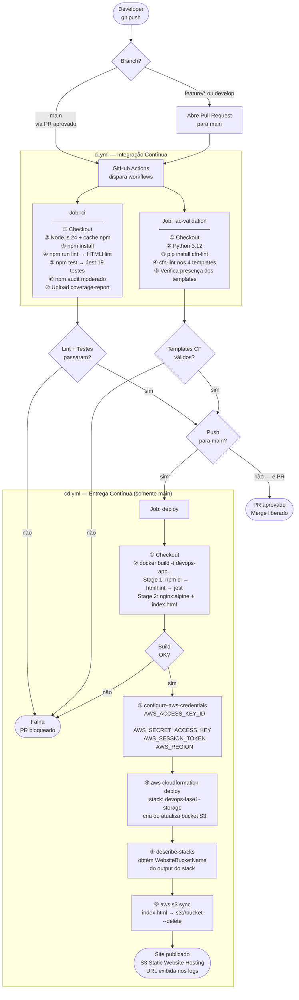

# Relatório Final — Projeto DevOps na Prática

**Aluna:** Daiane Deponti  
**E-mail:** daiane.deponti@edu.pucrs.br  
**Instituição:** PUCRS — Pontifícia Universidade Católica do Rio Grande do Sul  
**Disciplina:** DevOps na Prática  
**Repositório:** https://github.com/Daaaiii/Devops

---

## 1. Introdução

Este relatório documenta as duas fases do projeto da disciplina DevOps na Prática. O objetivo central foi construir um pipeline completo de CI/CD para uma aplicação web HTML estática, aplicando as práticas DevOps ensinadas em aula: controle de versão com branch strategy, integração contínua, containerização Docker, infraestrutura como código e entrega contínua em nuvem AWS.

---

## 2. Relatório da Fase 1 — Integração Contínua e Infraestrutura como Código

### 2.1 Repositório e Branch Strategy

O repositório foi estruturado no GitHub seguindo o modelo GitFlow simplificado:

- **`main`** — branch de produção, protegida. Nenhum commit direto é permitido; toda mudança exige Pull Request com revisão aprovada e CI passando.
- **`develop`** — branch de integração de features.
- **`feature/*`** — branches individuais de funcionalidades.

### 2.2 Pipeline de CI — `ci.yml`

O arquivo `.github/workflows/ci.yml` é acionado em push para `main` e `develop` e em Pull Requests abertos contra `main`. Ele executa dois jobs em paralelo:

**Job `ci` — Lint, Test & Audit**

| Passo | Comando | Objetivo |
|-------|---------|----------|
| Checkout | `actions/checkout@v4` | Obtém o código no runner |
| Setup Node.js 24 | `actions/setup-node@v4` (cache npm) | Ambiente de execução |
| Instalar dependências | `npm install` | Resolve pacotes |
| Lint HTML | `npm run lint` | HTMLHint valida estrutura HTML |
| Testes unitários | `npm test` | Jest — 19 testes, cobertura mínima 60% |
| Auditoria de segurança | `npm audit --audit-level=moderate` | Detecta vulnerabilidades nas dependências (não bloqueante) |
| Upload de cobertura | `actions/upload-artifact@v4` | Relatório retido por 7 dias |

**Job `iac-validation` — Validação de IaC**

| Passo | Comando | Objetivo |
|-------|---------|----------|
| Setup Python 3.12 | `actions/setup-python@v5` | Ambiente para cfn-lint |
| Instalar cfn-lint | `pip install cfn-lint` | Ferramenta de validação CF |
| Validar templates | `cfn-lint` em 4 arquivos | Detecta erros nos templates |
| Verificar presença | script bash | Garante que todos os templates existem |

Os dois jobs rodam em paralelo; ambos precisam passar para que o PR possa ser mergeado.

### 2.3 Infraestrutura como Código — AWS CloudFormation

Quatro templates em `infrastructure/cloudformation/`:

| Template | Recursos provisionados |
|----------|------------------------|
| `network.yaml` | VPC, subnets públicas, Internet Gateway, Route Tables |
| `compute.yaml` | EC2 t2.micro, Security Group (portas 80, 443, 22) |
| `storage.yaml` | Bucket S3 para hospedagem estática, bucket de artefatos, bucket policy pública |
| `main.yaml` | Stack pai que orquestra os três stacks filhos via nested stacks |

Todos os stacks são parametrizáveis por ambiente (`development`, `staging`, `production`).

---

## 3. Relatório da Fase 2 — Entrega Contínua e Containerização

### 3.1 Expansão do Pipeline de CI para Inclusão do CD

A principal mudança da Fase 2 foi a criação do arquivo `.github/workflows/cd.yml`, que estende o pipeline existente com a camada de entrega contínua. A separação em dois arquivos foi uma decisão deliberada de design:

| | `ci.yml` | `cd.yml` |
|--|----------|----------|
| **Gatilho** | push em `main`/`develop`, PRs contra `main` | push em `main` apenas |
| **Escopo** | Qualquer branch — valida qualidade | Somente `main` — realiza o deploy |
| **Responsabilidade** | Lint, testes, auditoria, validação IaC | Build Docker, provisionamento AWS, publicação S3 |

Essa separação garante que o CI protege a qualidade em todo o ciclo de desenvolvimento, enquanto o CD só é acionado quando código revisado e aprovado chega à branch principal. O encadeamento implícito entre os dois é garantido pela branch protection: um push direto à `main` só é possível via PR com CI verde — quando o `cd.yml` dispara, a qualidade já foi validada pelo `ci.yml`.

### 3.2 Containerização da Aplicação com Docker

A aplicação foi containerizada com um **Dockerfile multi-stage** na raiz do repositório:

```dockerfile
# Stage 1 — builder: install deps, run lint and tests
FROM node:24-alpine AS builder
WORKDIR /app
COPY package*.json ./
RUN npm ci
COPY . .
RUN npx htmlhint index.html
RUN npx jest --coverage

# Stage 2 — final: lean production image (~25 MB)
FROM nginx:alpine
COPY --from=builder /app/index.html /usr/share/nginx/html/index.html
EXPOSE 80
```

**Stage 1 — `builder` (node:24-alpine):**
- `npm ci`: instalação determinística baseada no `package-lock.json`
- `npx htmlhint index.html`: valida o HTML — interrompe o build se houver erros
- `npx jest --coverage`: executa todos os testes — interrompe o build se algum falhar

**Stage 2 — `final` (nginx:alpine):**
- Copia somente o `index.html` validado do stage anterior
- Imagem final com ~25 MB — sem Node.js, node_modules ou arquivos de teste
- Servida pelo nginx em produção

O multi-stage é o mecanismo que une qualidade e entrega: apenas artefatos que passaram em todas as verificações chegam à imagem de produção.

### 3.3 Script de Deploy Utilizando os Containers — `cd.yml`

O pipeline de CD realiza o deploy completo em seis etapas sequenciais:

**Etapa 1 — Checkout do repositório**
```yaml
- uses: actions/checkout@v4
```

**Etapa 2 — Build da imagem Docker**
```yaml
- name: Build da imagem Docker (multi-stage)
  run: docker build -t devops-app .
```
O `docker build` executa o Dockerfile multi-stage inteiro: lint + testes dentro do container. Se qualquer etapa falhar, o pipeline para aqui.

**Etapa 3 — Configuração de credenciais AWS**
```yaml
- uses: aws-actions/configure-aws-credentials@v4
  with:
    aws-access-key-id:     ${{ secrets.AWS_ACCESS_KEY_ID }}
    aws-secret-access-key: ${{ secrets.AWS_SECRET_ACCESS_KEY }}
    aws-session-token:     ${{ secrets.AWS_SESSION_TOKEN }}
    aws-region:            ${{ secrets.AWS_REGION }}
```
As credenciais são armazenadas como GitHub Secrets e nunca aparecem no código ou nos logs.

**Etapa 4 — Deploy do stack CloudFormation (provisionamento do S3)**
```yaml
- name: Deploy stack CloudFormation — storage
  run: |
    aws cloudformation deploy \
      --template-file infrastructure/cloudformation/storage.yaml \
      --stack-name devops-fase1-storage \
      --parameter-overrides BucketNameSuffix=devops-pucrs \
      --region ${{ secrets.AWS_REGION }} \
      --no-fail-on-empty-changeset
```
O bucket S3 é criado automaticamente se não existir, ou atualizado se já existir. Não há necessidade de criação manual.

**Etapa 5 — Obtenção dinâmica do nome do bucket**
```yaml
- name: Obter nome do bucket via output do CloudFormation
  id: bucket
  run: |
    BUCKET_NAME=$(aws cloudformation describe-stacks \
      --stack-name devops-fase1-storage \
      --query "Stacks[0].Outputs[?OutputKey=='WebsiteBucketName'].OutputValue" \
      --output text \
      --region ${{ secrets.AWS_REGION }})
    echo "name=$BUCKET_NAME" >> $GITHUB_OUTPUT
```
O nome do bucket é resolvido dinamicamente pelo output do stack CloudFormation, eliminando um secret estático `S3_BUCKET_NAME`.

**Etapa 6 — Sync do `index.html` para o S3 e exibição da URL**
```yaml
- name: Deploy para S3 — hospedagem estática
  run: |
    aws s3 sync . s3://${{ steps.bucket.outputs.name }} \
      --exclude "*" \
      --include "index.html" \
      --delete \
      --region ${{ secrets.AWS_REGION }}

- name: Exibir URL do site
  run: |
    echo "Site publicado em: http://${{ steps.bucket.outputs.name }}.s3-${{ secrets.AWS_REGION }}.amazonaws.com/index.html"
```

---

## 4. Demonstração Prática — Fluxo DevOps Completo

### 4.1 Fluxograma de Todas as Etapas do Pipeline



### 4.2 Tabela Resumo das Etapas

| # | Etapa | Workflow | Ferramenta | Resultado |
|---|-------|----------|------------|-----------|
| 1 | Checkout | CI + CD | `actions/checkout@v4` | Código disponível no runner |
| 2 | Lint HTML | CI | HTMLHint via `npm run lint` | HTML válido |
| 3 | Testes unitários | CI | Jest — 19 testes | 100% passando, cobertura ≥ 60% |
| 4 | Auditoria de segurança | CI | `npm audit` | Sem vulnerabilidades moderadas+ |
| 5 | Validação IaC | CI | cfn-lint | 4 templates CloudFormation sem erros |
| 6 | Build Docker multi-stage | CD | `docker build` | Imagem `devops-app` com artefato validado |
| 7 | Credenciais AWS | CD | `configure-aws-credentials@v4` | Sessão AWS autenticada |
| 8 | Deploy CloudFormation | CD | `aws cloudformation deploy` | Stack `devops-fase1-storage` criado/atualizado |
| 9 | Nome do bucket | CD | `aws cloudformation describe-stacks` | Nome resolvido dinamicamente |
| 10 | Sync S3 | CD | `aws s3 sync` | `index.html` publicado |
| 11 | URL publicada | CD | log do runner | URL exibida no GitHub Actions |

---

## 5. Análise dos Resultados

### 5.1 O que funcionou bem

- **Separação CI/CD em arquivos distintos:** responsabilidades claras sem acoplamento — o CI protege a qualidade em todas as branches, o CD entrega somente o que foi aprovado para `main`.
- **Docker como portão de qualidade duplo:** lint e testes rodam tanto no CI (via `npm`) quanto no CD (dentro do `docker build`), garantindo que nenhum artefato não testado chegue à AWS.
- **Provisionamento automático do S3:** o bucket é criado e configurado pelo CloudFormation a cada execução, sem intervenção manual e sem secret de nome estático.
- **Resolução dinâmica do bucket:** o nome é obtido via output do stack, tornando o pipeline resiliente a mudanças de configuração.
- **Jobs paralelos no CI:** `ci` e `iac-validation` rodam simultaneamente, mantendo o tempo total de feedback baixo.
- **Segredos gerenciados pelo GitHub:** credenciais AWS nunca aparecem no código, histórico git ou logs.

### 5.2 Limitações encontradas

- **Credenciais temporárias (AWS Academy):** as credenciais do Learner Lab expiram a cada ~4 horas, exigindo atualização manual dos três secrets antes de cada deploy.
- **Ausência de ambiente de staging:** o deploy vai direto à produção sem etapa intermediária de validação em ambiente isolado.
- **Imagem Docker não publicada:** a imagem `devops-app` é construída e descartada no runner — não é publicada em nenhum registry, sem rastreabilidade de versões.
- **Aplicação simples:** por ser HTML estático, o pipeline demonstra os conceitos sem exercitar build complexo (compilação, geração de assets, bundling).

---

## 6. Sugestões de Melhorias

| Melhoria | Benefício esperado |
|----------|--------------------|
| Autenticação AWS via OIDC | Elimina secrets de credenciais temporárias; autenticação federada e segura sem rotação manual |
| Ambiente de staging antes de produção | Promoção controlada: valida o deploy em ambiente isolado antes de ir a produção |
| Publicar imagem no Amazon ECR | Rastreabilidade de versões; base para deploy futuro em ECS ou EKS |
| Amazon CloudFront na frente do S3 | HTTPS, CDN global, cache de borda, domínio customizado |
| Monitoramento com AWS CloudWatch | Alertas automáticos de erros e visibilidade de latência em produção |
| Testes e2e com Playwright no CI | Valida o comportamento real da página no browser como etapa do pipeline |
| Versionamento de artefatos no S3 | Permite rollback rápido para versões anteriores em caso de incidente |

---

## 7. Conclusão

O projeto percorreu o ciclo DevOps completo em duas fases: a Fase 1 estabeleceu a base com repositório estruturado, pipeline de CI com lint, testes e validação de IaC via CloudFormation; a Fase 2 expandiu esse pipeline com containerização Docker multi-stage e entrega contínua automatizada para o S3.

A arquitetura final combina GitHub Actions (CI/CD separados e complementares), Docker (qualidade garantida na própria imagem) e AWS CloudFormation + S3 (infraestrutura reproduzível e hospedagem estática), resultando em um pipeline auditável, seguro e totalmente automatizado — do commit à URL pública — sem qualquer intervenção manual no fluxo de entrega.
